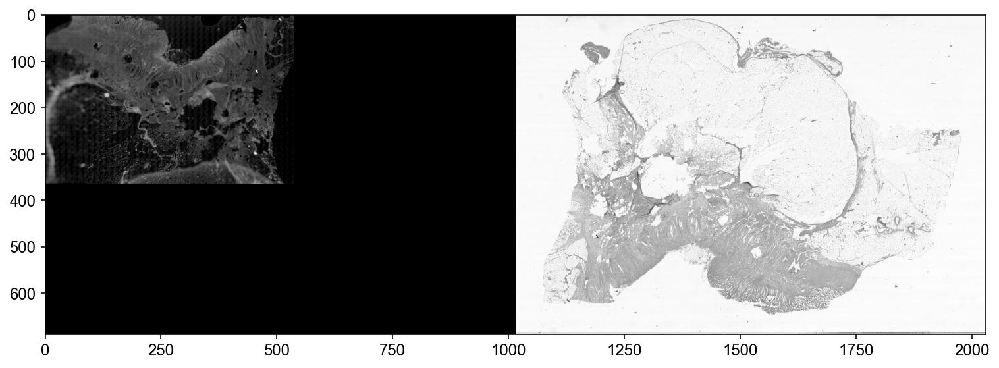
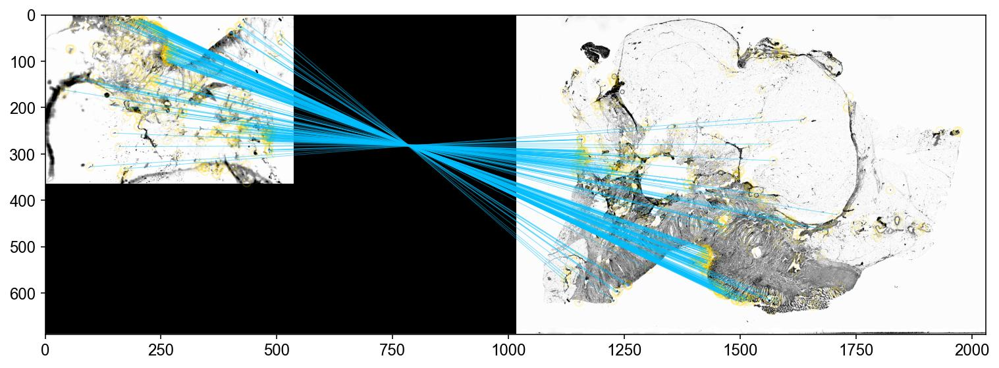
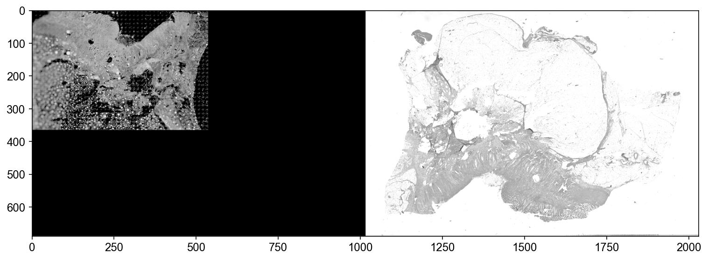
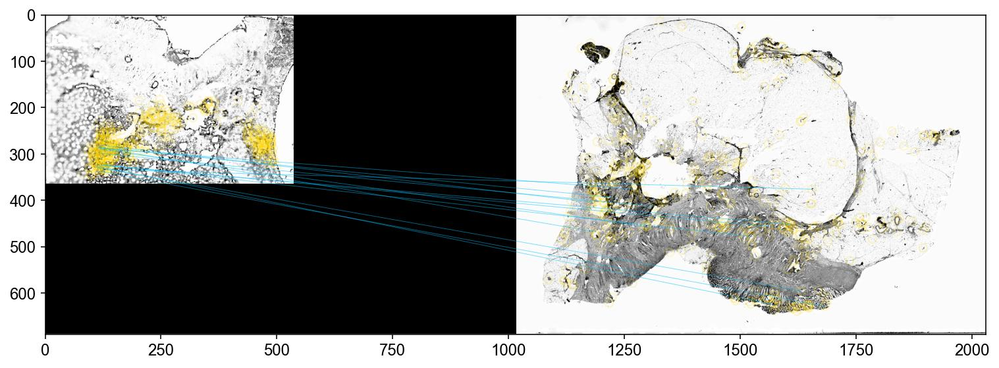

# User Guide for the `palom-align-he` Command

## Intended use case

The command is designed for aligning a pair of whole-slide images (WSIs) that
were generated from __the same tissue section__ but with different stains or/and
imaged on different microscopes or magnifications. This alignment is necessary
to enable co-visualization, analysis, or feature extraction across different
imaging modalities.

Currently, the command assumes that the reference image is an immunofluorescent
(IF) image, and the moving image is an H&E (RGB) image.

## Installation

__NOTE: If you’re using a non-Windows machine or want to install palom in your
current Python environment, please follow the [installation instructions for
`palom`](https://github.com/labsyspharm/palom?tab=readme-ov-file#installation).__

__NOTE: The following steps are for Windows 64-bit machines ONLY.__

1. If Anaconda or Miniconda isn't already installed, [install
   miniconda](https://docs.conda.io/en/latest/miniconda.html)

1. Create conda environment (`palom`) and install packages

    ```bash
    curl -f -o palom-env-win-64.lock https://raw.githubusercontent.com/labsyspharm/palom/refs/heads/main/conda-env/env-win-64.lock
    
    conda create --name palom --file palom-env-win-64.lock
    ```

1. Activate the created env and install other packages that are not available in
   conda

   ```bash
   conda activate palom
   
   python -m pip install opencv-python-headless==4.10.0.84 slideio==2.6.2 napari-lazy-openslide==0.3.0
   ```

1. Install `palom`

    ```bash
    python -m pip install palom==2024.10.2 --no-deps
    ```

## Usage

### a. Align two images (`palom-align-he run-pair`)

This command aligns the moving image (P2) to the reference image (P1) and saves
the results (aligned image in OME-TIFF format, quality control plots, and log
file) to the specified output directory (OUT_DIR):

```bash
palom-align-he run-pair 
    /path/to/reference/image/P1.ome.tiff
    /path/to/moving/he/image/P2.vsi
    /path/to/OUT_DIR
```

---

Alternatively, you can explicitly specify argument names:

```bash
palom-align-he run-pair 
    --p1 /path/to/reference/image/P1.ome.tiff
    --p2 /path/to/moving/he/image/P2.vsi
    --out_dir /path/to/OUT_DIR
```

---

Only run coarse alignment and generate QC plots without transforming the moving
image:

```bash
palom-align-he run-pair 
    /path/to/reference/image/P1.ome.tiff
    /path/to/moving/he/image/P2.vsi
    /path/to/OUT_DIR
    --only_coarse
    --only_qc
```

---

Use a specific channel (e.g., the first channel) from the reference image during
coarse alignment, and do not mask the background:

```bash
palom-align-he run-pair 
    /path/to/reference/image/P1.ome.tiff
    /path/to/moving/he/image/P2.vsi
    /path/to/OUT_DIR
    --thumbnail_channel1 0
    --auto_mask False
```

---

Adjust intensity range of the transformed H&E image to 0-200 and also save a
JPEG-compressed OME-TIFF:

```bash
palom-align-he run-pair 
    /path/to/reference/image/P1.ome.tiff
    /path/to/moving/he/image/P2.vsi
    /path/to/OUT_DIR
    --intensity_in_range "(0, 200)"
    --jpeg_compress
```

---

### b. Align multiple image pairs (`palom-align-he run-batch`)

The `run-batch` subcommand automates the process of aligning multiple pairs of
images by taking a CSV file as input. Each row in the CSV file represents a pair
of images, and the header of the CSV specifies the argument names that
correspond to the parameters of the `run-pair` subcommand.

For each row in the CSV file, `run-batch` executes the `run-pair` function to
align the corresponding image pair. If additional arguments are specified in the
`run-batch` command itself (outside of the CSV), they will be passed to each
execution of `run-pair`. In cases where an argument is provided both in the CSV
and in the command-line call, the argument from the command-line call will take
precedence, overriding the CSV value.

---

Example CSV file (`example.csv`):

```csv
p1,p2
/path/to/reference/image/P1.ome.tiff,/path/to/moving/he/image/P2.vsi
/path/to/X1.ome.tif,/path/to/Y1.vsi
/path/to/X2.ome.tif,/path/to/Y2.vsi
```

Run all the image pairs listed in the CSV file, use the same output directory,
with only coarse alignment and no transformation of the moving images:

```bash
palom-align-he run-batch example.csv
    --out_dir /path/to/OUT_DIR
    --only_coarse
    --only_qc
```

---

## Details and Recommendations

- The image alignment process consists of two key stages:

    1. __Coarse Alignment:__ This stage aligns lower-resolution versions
       (thumbnails) of the input images. It uses [ORB (Oriented FAST and Rotated
       BRIEF)](https://docs.opencv.org/4.x/d1/d89/tutorial_py_orb.html) for
       detecting and describing keypoints in both images. Then, [brute-force
       matching](https://docs.opencv.org/4.x/dc/dc3/tutorial_py_matcher.html) is
       applied to find matching keypoints between the images. These matches are
       used to compute an affine transformation, aligning the two thumbnail
       images.

    1. __Refined Alignment__: After coarse alignment, the coarsely-aligned
       full-resolution images are aligned using a refined process.
       Phase-correlation is used to determine X-Y shifts (translations) in the
       images, block by block, to achieve a precise alignment.

- Achieving a good coarse alignment is crucial. While the `align-pair` command
  attempts to handle differences in image orientation and contrast, visual
  review of the coarse alignment QC plots is still recommended.

  Below is an example of a successful coarse alignment, where feature detection
  and matching are effective between the two thumbnails:
  
  
  _IF (left) and H&E (right) thumbnails to be aligned_

  
  _Sucessful feature detection and matching after "auto-contrast"; corresponding keypoints in the images are connected by blue lines_

  And when a different channel is used in the IF image, the coarse alignment may
  fail, as shown below with poor feature detection and matching:

  
  _IF (left) and H&E (right) thumbnails to be aligned_
  
  
  _Failed feature detection and matching after "auto-contrast"; the blue lines
  are not connecting the right corresponding locations_

- What to adjust when the coarse alignment fails?

  - `--thumbnail_channel1` or/and `--thumbnail_channel2` for specifying
    different channels for feature detection and matching
  - `--n_keypoints` for adjusting the number of keypoints detected in the images
  - `--auto_mask` for specifying whether to automatically mask the non-tissue
    region in the image
  - Checkout [argument defaults in the `run-pair`
    command](#argument-defaults-in-run-pair) section for more info

- When aligning multiple images in batch mode, it is recommended to run the
  command with the `--only_qc` and `--only_coarse` options first. This will
  generate only the coarse alignment and QC plots, allowing you to visually
  inspect the quality of the alignment. Once you have confirmed that the coarse
  alignment is satisfactory, you can proceed with the full-resolution refined
  alignment.

## Argument defaults in `run-pair`

```txt
NAME
    palom-align-he run-pair

SYNOPSIS
    palom-align-he run-pair P1 P2 OUT_DIR <flags>

POSITIONAL ARGUMENTS
    P1
        Type: str | pathlib.Path
    P2
        Type: str | pathlib.Path
    OUT_DIR
        Type: str | pathlib.Path

FLAGS
    --out_name=OUT_NAME
        Type: Optional[str]
        Default: None
    --thumbnail_channel1=THUMBNAIL_CHANNEL1
        Help: channel index (0-based) in P1 to use for coarse alignment;
              default is the second channel (autofluorescence)
        Type: int
        Default: 1
    --thumbnail_channel2=THUMBNAIL_CHANNEL2
        Help: channel index (0-based) in P2 to use for coarse alignment
              default is the second channel (G in RGB image)
        Type: int
        Default: 1
    --channel1=CHANNEL1
        Help: channel index (0-based) in P1 to use for refined alignment;
              default is the first channel (DAPI/Hoechst)
        Type: int
        Default: 0
    --channel2=CHANNEL2
        Help: channel index (0-based) in P2 to use for coarse alignment;
              default is the third channel (B in RGB image)
        Type: int
        Default: 2
    -n, --n_keypoints=N_KEYPOINTS
        Help: Number of keypoints to extract for matching during coarse
              alignment; between 5000 to 20000 is recommended
        Type: int
        Default: 10000
    -a, --auto_mask=AUTO_MASK
        Help: Automatically mask non-tissue regions in the image during
              coarse alignment
        Default: True
    --only_coarse=ONLY_COARSE
        Help: Only perform coarse alignment
        Type: bool
        Default: False
    --only_qc=ONLY_QC
        Help: Only run alignments without transforming the moving image (P2)
        Type: bool
        Default: False
    --multi_res=MULTI_RES
        Type: bool
        Default: True
    --multi_obj=MULTI_OBJ
        Type: bool
        Default: False
    --multi_obj_kwarg=MULTI_OBJ_KWARG
        Type: Optional[dict]
        Default: None
    -i, --intensity_in_range=INTENSITY_IN_RANGE
        Help: Adjust contrast range in the transformed moving image if P2 is
              an RGB image; in the format of "(MIN_VALUE, MAX_VALUE)"
        Type: Optional[tuple]
        Default: None
    -j, --jpeg_compress=JPEG_COMPRESS
        Help: Write a copy of JEPG compressed RGB image if P2 is an RGB image
        Type: bool
        Default: False
```
